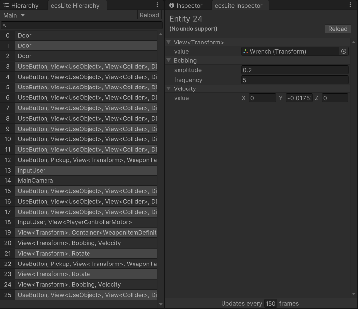

# ecsLite Debugger



This allows for you to debug all entities and modify them via custom inspectors.

## Installation
This package relies on [ecsLite](https://github.com/LeoECSCommunity/ecslite) (this is the community version).

```
https://github.com/LeoECSCommunity/ecslite.git
```

### Installing this package

#### Using Unity Package Manager
1. Open the Package Manager from `Window/Package Manager`
2. Click the '+' button in the top-left of the window
3. Click 'Add package from git URL'
4. Provide the URL of this git repository: https://github.com/nomnomab/EcsLiteDebugger.git
5. Click the 'add' button

## Usage
It is very simple to set up the debugger for your world(s). Simply add a `WorldDebugSystem` to your systems, and it will run off of its owner systems.
```csharp
// the provided name is for displaying a name in the hierarchy dropdown menu
_mySystems.Add(new WorldDebugSystem("My World"));

// make sure to initialize your systems so it can set-up properly
_mySystems.Init();
```

The windows are located in the menu bar under:
- `Tools/Nomnom/ecsLite Hierarchy`
- `Tools/Nomnom/ecsLite Inspector`
> The hierarchy is the "brain" of both windows. If it isn't visible, or open, the inspector will not update.

## Creating a custom inspector for a type
> You cannot have multiple guis for the same type.

Example of the internal integer gui
```csharp
// the generic type is for internal usage of a type that supports INotifyValueChanged<T>
// it would auto-register the event for you if applicable
public class IntegerGui: FieldGui<int> {
  public IntegerGui(ComponentField field) : base(field) { }

  // runs when the value is updated on the component itself
  public override void UpdateValue(object value) {
    ((IntegerField)Element).SetValueWithoutNotify((int)value);
  }
  
  // runs when the element has to be redrawn and needs a new element
  // to inject into the inspector
  protected override VisualElement CreateInternal(object item, FieldInfo fieldInfo) {
    return new IntegerField(fieldInfo.Name) {
      value = (int)fieldInfo.GetValue(item)
    };
  }
}
```